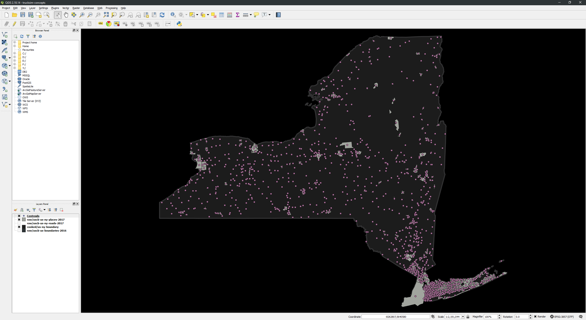
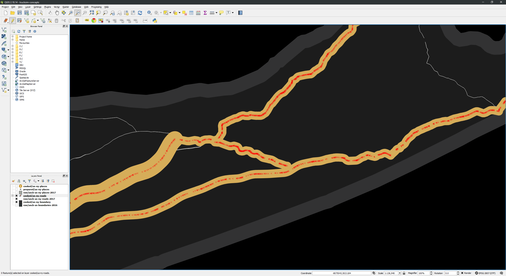

# Truck Simulator Concept Maps

This is a guide to making concept maps for [American Truck Simulator](https://americantrucksimulator.com/) and [Euro Truck Simulator 2](https://eurotrucksimulator2.com/). I will keep the instructions fairly generic but this guide will focus on creating concept maps for American Truck Simulator, specifically for [New York State](https://www.ny.gov/). The goal of this guide will be to produce a plausible and accurate map for NYS that mimics the style of the maps found in-game.

## Software Installation

In order to make these maps we need to install some software. Luckily all the software we need are [FOSS](https://en.wikipedia.org/wiki/Free_and_open-source_software) and available for Windows, macOS, and Linux. Specifically we need:

* [**QGIS**](https://qgis.org/) ([Installation](http://docs.qgis.org/2.18/en/docs/user_manual/introduction/getting_started.html#installation)) &mdash; An application for working with [Graphical Information System (GIS)](https://en.wikipedia.org/wiki/Geographic_information_system) data. This is where we will be doing most of our work. (*Note:* This guide was written using QGIS 2.18.14, 64-bit on Windows)
* [**Inkscape**](https://inkscape.org/) ([Installation](http://wiki.inkscape.org/wiki/index.php/Installing_Inkscape)) &mdash; An application for working with [vector graphics](https://en.wikipedia.org/wiki/Vector_graphics). This will allow us to work with some files necessary to match the style of the in-game maps. (*Note:* This guide was written using Inkscape 0.92.2, 64-bit on Windows)

The actual process of installing these programs is outside the scope of this guide. Follow the documented instructions for each application as linked to above.

You will also need software that can extract [ZIP](https://en.wikipedia.org/wiki/Zip_(file_format)) archives. I have no specific recommendation since such software is readily available for all systems and is often built-in.

In addition to software, we need some additional resources:

* [**Liberation fonts**](https://pagure.io/liberation-fonts) &mdash; A set of FOSS fonts. Install the fonts using the appropriate steps for your system.
* [**Roadgeek 2014**](https://github.com/sammdot/roadgeek-fonts/releases) &mdash; A set of FOSS fonts. Install the fonts using the appropriate steps for your system.
* [**Custom QGIS styles**](files/styles.zip) &mdash; A set of prebuilt styles for QGIS we will be using to mimic the style of the in-game maps.

##Data Acquisition

After you have installed the necessary software, the next step is to acquire the GIS data necessary to make an accurate map. There are three general classes of GIS data you need:

- Region boundary data &mdash; Polygon data that defines the boundaries of countries (ETS2) or states (ATS).
- Road centerline data &mdash; Line data that defines the centerlines of roads.
- Place area data &mdash; Polygon data that defines the area of named locations (municipalities).

In the United States, both the individual states and the federal government maintain such data online. For consistency and ease of use, we will use the data provided by the [United States Census Bureau](https://www.census.gov/). As works of the United States federal government all data we acquire from the Census Bureau is in the [public domain](https://en.wikipedia.org/wiki/Public_domain) and we are free to do with it as we wish.

The data we wish to acquire is part of the Census Bureau's [Topologically Integrated Geographic Encoding and Referencing](https://www.census.gov/geo/maps-data/data/tiger.html) (TIGER) dataset.

### Region Boundaries

The first piece of data we will acquire is the boundary data for the states and territories. This can be found by navigating to the [Cartographic Boundary Shapefiles](https://www.census.gov/geo/maps-data/data/tiger-cart-boundary.html) product from the TIGER homepage linked above.

The specific files we want are found through the **State** link under **Nation-based Files**.

Here we're given the option to choose between various years and resolutions. Let's choose the most recent (2016) and highest resolution (500k, the lower the number the higher the resolution) with the file **cb\_2016\_us\_state\_500k.zip** (3.14MB). Save this file in a safe location.

### Road Centerlines

The next piece of data we need to acquire is road centerline data. This data can be found by navigating to the [TIGER/Line Shapefiles](https://www.census.gov/geo/maps-data/data/tiger-line.html) product from the TIGER homepage as linked above.

From there we need to choose a year; again, let's just use the most recent (2017), and then select the **Web interface** option from the **Download** menu.

In the select boxes on the left, choose **2017** for **Select year** and **Roads** for **Select a layer type**, and then click **Submit**.

We are then given the choice of the granularity of the road data we want. We can choose either:

* Only primary roads at a national level.
* Primary and secondary roads at a state level.
* All roads at a county level.

Let's choose the second option, primary and secondary roads. This won't give us every one-lane road in the country, but it's sufficient detail for what we want to accomplish. For this level, we need to choose a specific state or territory, so let's choose **New York** and then press **Download**. This should now download the file **tl\_2017\_36\_prisecroads.zip** (8.77MB). Again, save this file someplace safe.

### Place Areas

The final piece of data we need to acquire is not critical but is useful nonetheless. Repeat the previous steps that you used to acquire the road data, except instead of selecting **Roads** for **Select a layer type**, select **Places** and press **Submit**.

Again, we need to choose a specific state or territory, so let's choose **New York** again and press **Download**. This should now download the file **tl\_2017\_36\_place.zip** (2.66MB). Again, save this file someplace safe.

## Data Import

Now that we have acquired all the requisite data, we can turn our attention to setting up our project and importing the data.

Firstly, start **QGIS Desktop** (*not* **QGIS Browser**).

From the menu click **Project > New**. You'll be met with an uninspiring blank window.

Immediately save this project by click **Project > Save**. You will be prompted for a location and name to save the project under. Create a new directory somewhere specifically for this project and save the project file there. I've named my directory **trucksim-concepts** and have named my project likewise. From here on out, I will refer to this directory as **PROJECT_ROOT**.

Next, navigate to **PROJECT_ROOT** in whatever file explorer your system uses and create a new directory **data** inside of it. In this directory create three more directories: **raw**, **prepared**, and **cooked**. These directories are where we will store all the data we will need for the project. The **raw** directory will store unmodified versions of the data we retrieved from the Census Bureau (or other source), the **prepared** directory will store modified versions of the data we retrieved but which isn't used to generate the final map, and the **cooked** directory will store the data that will produce the final map. These particular names are arbitrary, but they are the convention we will follow for this tutorial.

Inside the **raw** directory create three additional directories:

* **uscb-us-boundaries-2016**
* **uscb-us-ny-roads-2017**
* **uscb-us-ny-places-2017**

Again, these names are arbitrary but when dealing with a lot of data organization is important. The scheme for each of these directories is **\<source\>-\<country\>[-\<subdivison\>]-\<type\>-\<version\>**. The source is this case indicates the data is from the United States Census Bureau. Country codes are [ISO 3166-1 alpha-2](https://en.wikipedia.org/wiki/ISO_3166-1_alpha-2) codes, while subdivision codes are [ISO 3166-2](https://en.wikipedia.org/wiki/ISO_3166-2) codes. For Americans, state and territory ISO 3166-2 codes are equivalent to two-letter United States Postal Service abbreviations. Type indicates the basic kind of data that is stored, while version is some string which allows multiple iterations of the same data to be distinguished.

Now, extract the contents of **cb\_2016\_us\_state\_500k.zip** to **uscb-us-boundaries-2016**, the contents of **tl\_2017\_36\_prisecroads.zip** to **uscb-us-ny-roads-2017**, and the contents of **tl\_2017\_36\_place.zip** to **uscb-us-ny-places-2017**. Once extracted, each directory should contain eight files. At this point it is a good idea to make all these files read-only using whatever means your operating system has available to you. This should prevent you for accidentally modifying the data in QGIS.

Now in QGIS, click **Layer >  Add Layer > Add Vector Layer...** from the menu.

Click the **Browse** button and navigate to your **uscb-us-boundaries-2016** directory. Select the `.shp` file and click the **Open** button in the **Add vector layer** dialog. You should now see an image of the United States with all its states and territories in your main window.

(Don't worry if your colors differ from the ones in the screenshots in this guide, QGIS assigns them randomly).

One thing that you may immediately notice is that the United States looks *weird*, specifically, you likely think the United States looks stretched horizontally, especially Alaska. Welcome to the world of [map projections](https://en.wikipedia.org/wiki/Map_projection). Due to how the math works, it's impossible to perfectly render the surface of a sphere (like a planet) onto a two dimensional surface (like a computer monitor). Therefore there are a variety of map projections which take the spherical coordinates and translate them onto a plane. However, because it's impossible to do this perfectly, each projection does things differently and you get different results. No result is really more "correct" than any other, they all make various tradeoffs, but the above looks "wrong" to us, because it's not what we're used to. So in order to fix this we need to make QGIS use a projection that is more like what we are used to. By default, QGIS will use the [EPSG:4269](https://epsg.io/4269) projection, we're going to change it to the [EPSG:3857](https://epsg.io/3857) projection, which is used by most online mapping sites like [OpenStreetMap](https://www.openstreetmap.org/). In order to do that select **Project > Project Properties...** from the menu and go to the **CRS** tab.

Enable the **Enable 'on the fly' CRS transformation (OTF)** checkbox and in the **Filter** input, enter **EPSG:3857**. Only a single result should remain, **WGS 84 / Psuedo Mercator**.

Select it, and click the **OK** button. The United States should now look more like we're used to.

The map is currently zoomed out to show the entire world. However, since we'll be focusing on New York, let's zoom in on it. Click **View > Select > Select Feature(s)** from the menu and then click on New York.

Now click **View > Zoom to Selection** to have QGIS zoom the map to have NYS fill the screen.

Now click **View > Select > Deselect Features from All Layers** to clear your selection.

Next let's add the place data. Again, click **Layer > Add Layer > Add Vector Layer...**, click the **Browse** button and navigate to the **uscb-us-ny-places-2017** directory and select the **.shp** file in that directory. Click the **Open** button in the **Add vector layer** dialog to add it to the map.

Finally, let's add the road data. Repeat the above steps, but now navigate to **uscb-us-ny-roads-2017** and select the **.shp** file in that directory.

We now have all the data we need in QGIS to start working in earnest but before we get to that, let's do some house cleaning. On the left of QGIS should be a **Layers Panel**. Each layer represents the data we just imported. Right now each layer is named based on the file its data came from. To make things more consistent, right click on each layer and choose **Rename**. Then rename each layer to match the directory that contains it:

* **tl\_2017\_36\_prisecroads** becomes **raw/uscb-us-ny-roads-2017**
* **tl\_2017\_36\_place** becomes **raw/uscb-us-ny-places-2017**
* **cb\_2016\_us\_state\_500k** becomes **raw/uscb-us-boundaries-2016**

Finally, let's select some consistent styling for these layers. Since it is often very involved and there are so many options, we will not be going over the specifics of how layers are styled. Instead, I will provide you with an existing style that you can import into your project. However, I still encourage you to investigate yourself how to change and alter styles.

First, create a directory within your **PROJECT_ROOT** named **styles** and then extract the contents of the **styles.zip** you previously downloaded into it. The **styles** directory should now contain the following 14 files directly under it:

* **cooked-boundaries.qml**
* **cooked-places.qml**
* **cooked-roads.qml**
* **cooked-shields.qml**
* **prepared-places.qml**
* **raw-boundaries.qml**
* **raw-places.qml**
* **raw-roads.qml**
* **Shield-I.svg**
* **Shield-I-wide.svg**
* **Shield-NY.svg**
* **Shield-NY-wide.svg**
* **Shield-U.svg**
* **Shield-U-wide.svg**

Then, right click on the **raw/uscb-us-boundaries-2016** layer and select **Properties**.

The **Style** tab should be automatically selected. Click on the **Style** button at the bottom and click on the **Load Style** option. Then navigate to the **raw-boundaries.qml** file and open it. Finally, click the **OK** button in the **Layer Properties** dialog to apply the new style. 

Repeat the same operation for the places and roads layers.

Finally, let's set the background of the entire map to black to mimic the style of the in-game maps. From the menu, select **Project > Project Properties...**.

and then under the **General** tab click the **Background color** select box and in the **HTML notation** input enter *#000000* and press **OK** and **OK** again.

## Data Preparation

Before we can really begin working we need to prepare some data layers that will make our work easier.

### Boundary

The first thing we need to do is create a layer which contains only our New York State boundary. To do so, make sure the **raw/uscb-us-boundaries-2016** layer is selected in the **Layers Panel** and then click **View > Select > Select Features by Value...**.

For the **STUSPS** field enter **NY** and enable **Case sensitive** and select **Equal to (=)** in the rightmost select input.

Then click the **Select features** button. You may now click the **Close** button to dismiss the dialog. New York State (and only New York State) should be highlighted to indicate it is selected.

Technically, we could have accomplished the same by simply clicking on NYS, but the above operation of selecting features based on some specific attribute is something we're going to be using a lot, so we might as well get used to it now.

Now that NYS is selected, right click on the **raw/uscb-us-boundaries-2016** layer and click **Save As...**.

We need to change a few options before saving:

* Leave **Format** as **ESRI Shapefile**.
* For **File name** click the **Browse** button and navigate to your **cooked** directory. Create a new directory inside of it named **us-ny-boundary**. And specify the file name as the same thing inside the directory.
* For **CRS** change it to **Project CRS (EPSG:3857 - WGS 84 / Pseudo Mercator)**.
* Enable the checkbox **Save only selected features**.

Leave all other options as is and click the **OK** button. You should now have an additional layer named **us-ny-boundary**.

For consistency's sake, rename this layer to **cooked/us-ny-boundary**. Now click the **X** next to each **raw/** layer to hide it from view. You should now have a map that contains *only* the outline of New York State.

A brief note on our naming conventions: since the data in this layer was produced by us, derived from other data, it is not **raw** and since it will be in our final map it is **cooked**.

Since this layer will be in our final map, we should try to make it appear like how it would in-game. Start American Truck Simulator or Euro Truck Simulator, open the world map, and take a screenshot for reference.

The design of each state/country on the map is fairly simple: a dark gray background with a light gray border.

Now, right click on the **cooked/us-ny-boundary** layer, click **Properties**, and then click on the **Style** tab. Click on the **Style** button at the bottom of the dialog window and click **Load Style**. Open the **cooked-boundaries.qml** file that you previously saved and click **OK** in the **Layer Properties** dialog to apply it.

Remember to save your project before moving on.

### Places

The next thing we want to do is prepare our place data. The Census Bureau provides the place data as polygons which cover the area of the places, which is useful in general, but not particularly useful to us. More useful data to us would be points which represent the center of such areas, since that's basically all we care about for the purposes of our map. Luckily, deriving this data is relatively easy in QGIS.

First click the **X** next to the **raw/uscb-us-ny-places-2017** layer to make it visible once again and click on it to make it the selected layer.

With this layer selected, from the menu click on **Vector > Geometry Tools > Polygon centroids**. This will open a new dialog.

For **Input layer** select **raw/uscb-us-ny-places-2017 [EPSG:4269]**. For **Centroids** click the **...** button on the right side and click **Save to file...**. Navigate to your **prepared** directory and create a new directory within it named **us-ny-places**. Save the file inside this directory with the same name.

Now click the **Run** to let QGIS work its magic. Once done (it shouldn't take more than a couple of seconds), you should have a new layer named **Centroids** which produces a bunch of dots on top of our map.

The dots are point data which represent the [centroids](https://en.wikipedia.org/wiki/Centroid) of the place polygons we got from the Census Bureau. For consistency's sake, let's rename the **Centroids** layer to **prepared/us-ny-places**. Apply the **prepared-places.qml** style to this new layer.

Also disable the visibility of the **raw/uscb-us-ny-places-2017** layer.

Note that since this layer contains data we derived ourselves, but which won't appear in the final map, it is **prepared**. Therefore we still need to create the **cooked** version of this data. In order to do so right click on the **prepared/us-ny-places** and click **Save As...**. Use the following options:

* Set **Format** to **ESRI Shapefile**.
* For **File name** click the **Browse** button and navigate to your **cooked** directory. Create a new directory within it named **us-ny-places**, then set the filename to the same name within that directory.
* Set **CRS** to **Project CRS (EPSG:3857 - WGS 84 / Pseudo Mercator)**.
* Since no features should be selected, the **Save only selected features** checkbox should be disabled.

Click the **OK** button. You should now have a new layer named **us-ny-places**. Again, for consistency, rename it to **cooked/us-ny-places**.

Since this is suppose to be our final data, we don't want those points, so let's delete them. Select the **cooked/us-ny-places** layer, click **View > Select > Select All Features**, then click **Layer > Toggle Editing**.

Now click **Edit > Delete Selected** and **Layer > Toggle Editing**. QGIS should prompt you to save changes, click **Save**. The **cooked/us-ny-places** layer should now be empty and ready for us to add our own data when we're ready. Click the **X** next to the **prepared/us-ny-places** layer to disable its visibility.

### Roads

The final and most important piece of data we need to prepare for are roads. In order to do so, enable the visibility of the **raw/uscb-us-ny-roads-2017** layer.

Similar to what we did with the place data above, right click on the **raw/uscb-us-ny-roads-2017** and click **Save As...**. Follow similar steps to what we did above, except save the layer to **cooked/us-ny-roads.shp**. Make sure you use the Project CRS, instead of the default. Rename the new **us-ny-roads** layer to **cooked/us-ny-roads**. Repeat the steps above to delete all the features in this new layer. When complete you should have an empty **cooked/us-ny-roads** layer. Click the **X** next to the **raw/uscb-us-ny-roads-2017** to disable its visibility. Now the only layers visible should be the **cooked/** layers which represent the final map. Since we have added no places nor roads the map should just be the outline of New York.

We are now ready to begin constructing our map in earnest.

## Map Construction

### Places

Probably the first thing we need to decide is what cities our map will include. Our choice of cities will dictate which routes we should use. Selecting cities is more of an art than a science, but things to consider are:

* **Population** &mdash; Obviously the most populous cities are good candidates to select. In our case, New York City is an obvious candidate, being not only the most populous city in New York State, but the most populous city in all of the United States.
* **Proximity** &mdash; You should probably avoid cities that are too close together. American Truck Simulator and Euro Truck Simulator 2 maps are on a 1:20 scale with real life. Therefore cities that are close together in real life will be virtually indistinguishable from one another in-game. In our case, this means we should probably not include Yonkers, even though it is the fourth most populous city in New York State, because it is directly adjacent to New York City.
* **Location** &mdash; Cities that might not otherwise be considered but are near major routes are also good candidates. In our case, the city of Newburgh is the 22nd most populous city in New York State, but is also near the intersection of two major thoroughfares: Interstate 84 and 87.
* **Scenery** &mdash; Cities near especially scenic areas should also be considered. In our case, even if Buffalo weren't the second most populous city in New York, we would probably include it simply for its proximity to Niagara Falls.
* **Notability** &mdash; Some cities are just notable for whatever reason. Roswell, NM is an excellent example of this. In New York, Cooperstown, home of the Baseball Hall of Fame would be another example.
* **Number** &mdash; The last thing we should consider is what is a reasonable number of cities for our state or country. This is complicated because it needs to be "reasonable" compared to existing states and countries. For instance, it would probably not be reasonable for NYS to include 50 cities while California has only 22. Therefore, a good strategy is to compute the number of cities per area for existing states and countries and multiply that number by the area of our state or country to arrive at a value. Doing for that existing states in American Truck Simulator we find: California, 1.4; Nevada, 0.9; Arizona, 1.3 , and New Mexico 1.2, where each measurement is in cities per thousand square miles. Using the values for New York, we find that New York should have a minimum of 5 cities and a maximum of 7 with an average of 6. However, another metric we should consider is density. New York State, is nearly twice as dense as California at 420 people/square mile versus 251 people/square mile. It is also *24* times more dense than New Mexico at a mere 17 people/square miles. In general, the northeastern United States is significantly more densely populated than the the southwest. Therefore it would make sense to increase the number of cities to reflect this increase in population density. At this point, we return to more art than science. The formula I've chosen to compute an "expected" number of cities is in a state or country is: $n=\left\lceil\hspace{0.25em}ac\sqrt{\frac{d}{D}}\hspace{0.25em}\right\rceil$ where $n$ is the expected number of cities, $a$ is the area of the state or country, $c$ is the average city density, $d$ is the population density of the state or country, and $D$ is the average population density of all states or countries. Using this formula for New York State, produces a value of 14.

With the above considerations, the 14 cities I've chosen for New York State are:

1. Albany
2. Binghamton
3. Buffalo
4. Corning
5. Glens Falls
6. Islip
7. New York
8. Newburgh
9. Plattsburgh
10. Riverhead
11. Rochester
12. Syracuse
13. Utica
14. Watertown

Now that we've chosen our cities, we need to add them to a final, cooked, map. First enable visibility for our **prepared/us-ny-places** layer.

Now select the layer and click **Layer > Open Attribute Table**.

The attribute table lists all the *features* (individual elements) that make up the map layer and the data associated with each other. Our goal is to identify any fields that can help us select specific features that we're interested in. Luckily for us one such field is readily apparently: **NAME**, which appears to contain the common name for each place location. Now that we've established that, close the attribute table dialog. Now with the layer still selected, click **View > Select > Select Features by Value...**.

In the **Select features by value**, in the **NAME** field, enter **Albany**, and change the filter type to **Equal to (=)**.

Now click the **Select features** button. You should get a blue notification at the top of the map window indicating that exactly one feature was selected.

Close the **Select features by value** dialog and you should see a dot near the eastern middle section of the state highlighted, this is Albany.

Now we want to copy this to our cooked layer. In order to do so, click **Edit > Copy Features**. Now we need to paste it in our cooked layer. Select the **cooked/us-ny-places** layer, and click **Layer > Toggle Editing**. Now click **Edit > Paste Features**. You should get a blue notification that exactly one feature was pasted. The Albany marker should also have a red **X** over it, indicating that it is editable.

Click **Layer > Toggle Editing**, QGIS should prompt you to save changes to the layer, click **Save** to do so. Now disable the visibility of the **prepared/us-ny-places** layer. You should now have a single marker on your map from the **cooked/us-ny-places** layer for Albany.

All good so far, but remember that this is supposed to be our *final* map, and place markers in the in-game map certainly don't look like that. Let's try to modify the style of the layer to make it more like the in-game map. First by looking at the in-game map, we notice that place markers appear like large circles with a orange radial gradient that transitions to white near the center. The markers also feature the name of the city above it in orange sans-serif letters with a black outline. Apply the premade style **cooked-places.qml** to this layer.

Now let's repeat the steps to copy our all of our chosen cities from the **prepared** layer to the **cooked layer**.

Looking good!

### Roads

Now that we have our cities in place, we need to add roads to connect them. In the case of the United States, there are three main kinds of roads we care about: [interstates](https://en.wikipedia.org/wiki/Interstate_Highway_System), [US highways](https://en.wikipedia.org/wiki/United_States_Numbered_Highway_System), and [state highways](https://en.wikipedia.org/wiki/Numbered_highways_in_the_United_States#State_highways). Also, specifically for New York State, we want to avoid any road that is designated as a [parkway](https://en.wikipedia.org/wiki/Parkway) since trucks are not permitted on them.

Building out our road network is more art than science, but we generally want to have a robust network that would enable players to travel between any city pairs without going significantly out of their way. Where to begin is up to you, but let's say we want to start with connecting the state's largest city (New York) to its capital (Albany). If we open [OpenStreetMap](https://www.openstreetmap.org/) we'll see that there's a pretty obvious route connecting New York to Albany.

Zooming in further reveals this route to be I-87, Interstate 87.

Therefore, let's see if we can add I-87 to our map. In order to do so, however, we first need to *find* I-87 on our map. Therefore, enable the visibility of the **raw/uscb-ny-roads-2017** layer. Select it, right click, and click on **Open Attribute Table**.

Scan through the attributes to get a sense of what the data looks like. From a brief look, it appears the following facts are true:

* **RTTYP** indicates the route type using a single letter mnemonic. Of interest to us is **I** for *interstates*, **U** for *US highways*, and **S** for *state highways*.
* **FULLNAME** is what specifies the route number. In particular, interstates come in the form: **I- #** (note the space between the hyphen and the number). US highways come in the form: **US Hwy #**. State highways come in the form: **State Rte #**.

We can use this information to filter down all the roads to only those that represent I-87. Therefore, close the attribute table, select the **raw/uscb-us-ny-roads-2017** layer and click on **View > Select > Select Features by Value...**. In the **Select features by value** dialog, for the **FULLNAME** row, enter **I- 87** (note the space), enable **Case sensitive**, and change the filter option to **Equal to (=)**.

Now select the **Select features** button. You should see a blue notification informing you that 29 features have been selected and you should also see the route of I-87 highlighted in yellow, spanning the north-south length of NYS.

Click **Edit > Copy Features**. Select the **cooked/us-ny-roads** layer and click **Layer > Toggle Editing**. Now click **Edit > Paste Features**. The route of I-87 should now be copied into the **cooked/us-ny-roads** layer.

Click on **Layer > Toggle Editing** and click **Save** when prompted to save the layer. Click on **View > Select > Deselect Features from All Layers**. Disable visibility of the **raw/uscb-us-ny-roads-2017** layer.

Great, we now have I-87 on our **cooked** layer connecting New York, Newburgh, Albany, Glens Falls, and Plattsburgh (and Canada further north). However, this is our **cooked** layer, the expectation is that it should look like the in-game map. However, styling roads is complicated by the fact that there are two road styles: a thick one for major routes like interstates and a thin one for more minor routes like state highways. Luckily, QGIS's styling system is robust enough to change styles based on the attribute of the feature, so we'll style all interstates in the thick style and all US and state highways in the minor style. Apply the **cooked-roads.qml** style to this layer.

Let's add a state highway to make sure our rule-based styling works correctly. Repeat the previous steps, except this time select **State Rte 12**.

Great, we now have NY-12 which connects Binghamton, Utica, and Watertown. It also appears our rule-based styling is working correctly as it appears thinner than I-87.

However, there is one problem. NY-12 continues beyond Watertown to an empty area on our map. Now, while I'm sure such areas are great in real life, we simply have no room for them, thus making this northern extent of NY-12 extraneous. Luckily, we can trim it down.

First, zoom into the area so that Watertown is at the bottom of the viewport.

Now select the **cooked/us-ny-roads** layer and click on **Layer > Toggle Editing**.

Now click **View > Select > Select Feature(s)** and draw a box around the road segments north of Watertown to select them.

Now click **Edit > Delete Selected**. Then click **Layer > Toggle Editing** and click **Save** when prompted. NY-12 should now terminate in Watertown.

Click on **View > Zoom Full** to go back to a view which encompasses the entire state.

Now continue adding and trimming roads in this manner to build your desired road network.

At some point you may need to trim your road network but there is not a useful split in the features where you would like to make the split. For example, I wish to smoothly connect I-495 on Long Island to NY-27. But where the split occurs would not allow that smooth connection to occur:

If this occurs, make sure the **cooked/us-ny-roads** layer is selected and click **View > Select > Select Feature(s)** and draw a box around the road segments that you wish to split like in the example image above. Then click on **Layer > Toggle Editing**.

Then click on **Edit > Split Features**, now click somewhere near where you wish the road segment to be split, as you move your mouse around you should see a dashed red line, click again across the road segment where you want it to be split, like you're slicing a loaf of bread.

Now **right** click to complete the action. Now click **View > Select > Deselect Features from All Layers** to clear your selection.

Now use **View > Select > Select Feature(s)** to draw a box around the segments you want to remove. You should now see that the road segments are split at the point you cut them.

Now click on **Edit > Delete Selected** to remove those segments.

Finally, click **Layer > Toggle Editing** and save the project when prompted. 

Continue adding and trimming road segments in this manner until you satisfied with the results. In my case, this is what I produced:

This looks pretty, the only thing really missing are the highway shields.

### Shields

Highway shields are the signs which indicate the type and number of the different roads. In our case, we need three different shield types: interstate, US highway, and NY state route. We also need standard and wide versions of each, which are used for single/two digit and three digit numbers respectively.

While the interstate and US highway shields will be basically identical everywhere in the US, the state route shields will vary for each state. Therefore I will walkthrough how to make the shields for NY state routes and provide you with style files for the interstates and US highways.

First, we need the background image, specifically a *vector* image like SVG, not a *raster* image like PNG, BMP, or JPG. A good source for these is Wikipedia, which also provides them under a Creative Commons license.

First, search for "List of state routes in New York" on Wikipedia, which will bring you to this page: [List of state routes in New York](https://en.wikipedia.org/wiki/List_of_state_routes_in_New_York). Open the shield images for a single/two digit route and a three digit route in new tabs. In this case, I will open the shield image for [NY-2](https://en.wikipedia.org/wiki/File:NY-2.svg) and [NY-100](https://en.wikipedia.org/wiki/File:NY-100.svg). Find the *Original file* link, right click and save the files someplace where you can easily find them. Rename the **NY-2.svg** file to **Shield-NY.svg** and the **NY-100.svg** file to **Shield-NY-wide.svg**. Open **Shield-NY.svg** in Inkscape, which you installed earlier.

In Inkscape, click **View > Zoom > Page**.

Click **Edit > Select All** then click **Object > Ungroup** still will allow the components of the shield to be selected individually.

Now click on **Edit > Deselect**, then click on the number two in the image, then click **Edit > Delete**.

You now have a blank shield. Click **File > Save** to save it. Repeat the same operation for **Shield-NY-wide.svg**. Once you are done, you may close Inkscape. At this point you would move **Shield-NY.svg** and **Shield-NY-wide.svg** into your **styles** directory, but they should already be there from earlier.

Now we need to add some shields to map. We will use a dedicated layer for shields which we will need to create. So in QGIS, click on **Layer > Create Layer >  New Shapefile Layer...**. Set **Type** to **Point** and select **Project CRS (EPSG:3857 - WGS 84 / Pseudo Mercator)** from the dropdown. In the **New field** options set **Name** to **type**, set **Type** to **Text data** and, set **Length** to **2**, then click the **Add to fields list** button. Repeat the previous step with **number** for **Name**, **Text data** for **Type**, and **4** for **Length**. Then click on the **id** field in the **Fields list** and click **Remove field**.

Then click **OK**. You will now be prompted to save the new layer. Navigate to your **data/cooked** directory and create a new directory named **us-ny-shields**, save the layer inside this directory with the same name. You should now have a new layer named **us-ny-shields** in your **Layers Panel**, for consistency rename it to **cooked/us-ny-shields** and drag it down to just below **cooked/us-ny-places**. Save the project.

Let's place our first shield. I'm going to place it on NY-25, at the northern tip of Long Island in the southeast of the map. Make sure the **cooked/us-ny-shields** layer is selected and click **Layer > Toggle Editing**. Then click **Edit > Add Feature**. Your cursor should change to a reticle looking shape, click on the tip of NY-25 to place a marker at that location. You will now be prompted to set the feature attributes. We will follow the following convention: **type** should be set to **I** for interstate shields, **U** for US highway shields, and the two digit state abbreviation for state routes, in the case of New York, that would be **NY**. **number** is simply the number of the route, in this case **25**. Enter the appropriate information.

Finally, click **OK** to add the marker to the layer. Then click **Layer > Toggle Editing**. You should see the marker added to the map, but it is quite unimpressive as a small colored circle. We need to make it look like a shield. Apply the **cooked-shields.qml** style to this layer. The premade style already includes styles for interstates, US highways, and NY state routes including both standard and wide variants. If you need to create your own, investigate how the existing ones are done and copy new rules. The main things you'll need to change are the **type** value in the **Filter** and the path to the SVG image to use.

Now following the previous steps add shield markers wherever you deem it appropriate. This is my result:

With that, we're pretty much done. Now we only need to export our map into a usable format.

## Map Export

Click on **View > Zoom Full**, then click on **Project > New Print Composer**. For the title enter **Image Export**, and click **OK**.

Click on **View > Zoom Full**.

On the right column, change the page size as appropriate. Since I'm in the US, I'll change it to **ANSI A (Letter; 8.5x11in)**. Click on **Layout > Add Map** and drag a rectangle to fill most of the page.

Drag the sides of the map to perfectly cover the entire page.

You may need to click **View > Refresh** to get an updated look after changing the size. Click on the map and select the **Item properties** tab on the right. Click on the **Set to map canvas extent** button.

Play with the **Scale** field under **Main properties** until the state fills most of the page. Use the **Update preview** button to see its effects. I got good results with a **Scale** of **3300000**.

Now click **Edit > Deselect All**.

Now, click on **Composer > Export as Image...**. Save the file in a convenient location with a convenient name. In the **Image export options** set the size to something reasonable (I used with width of 4096px), and ***finally*** click **Save**. This is our final result:

